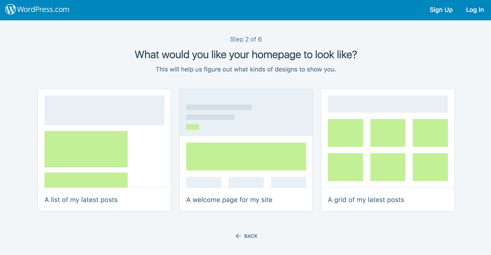
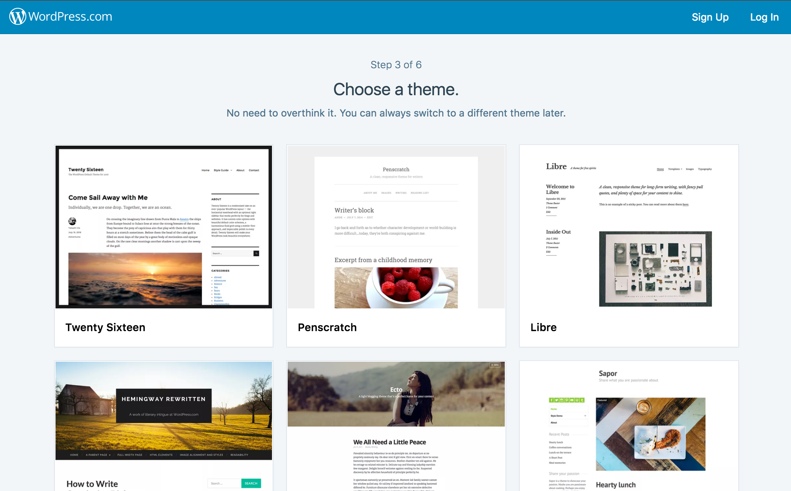
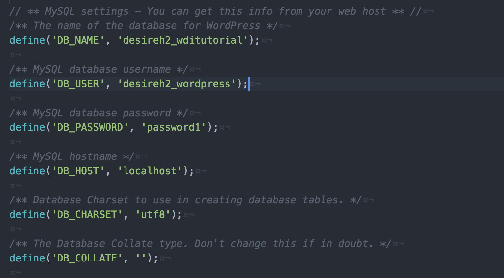
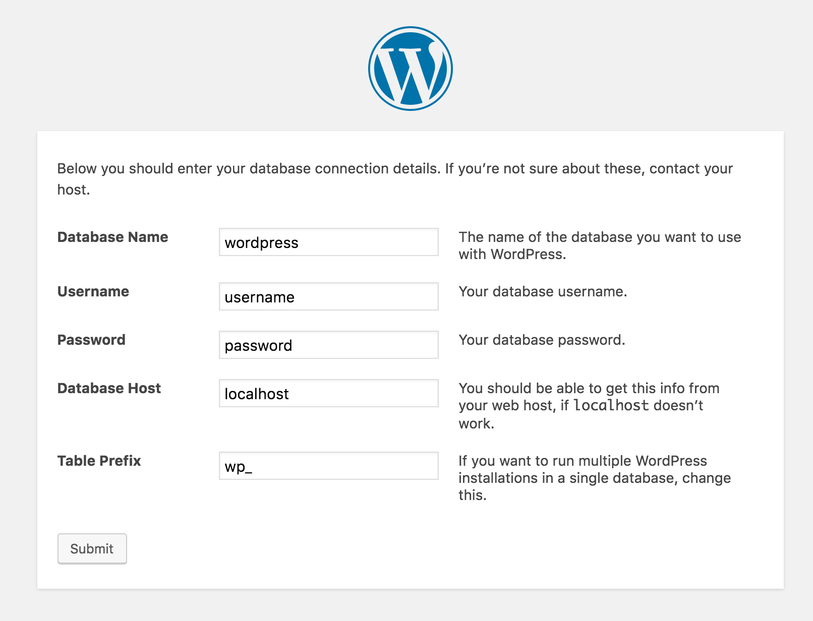
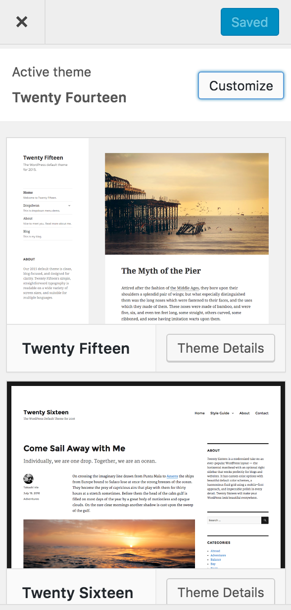
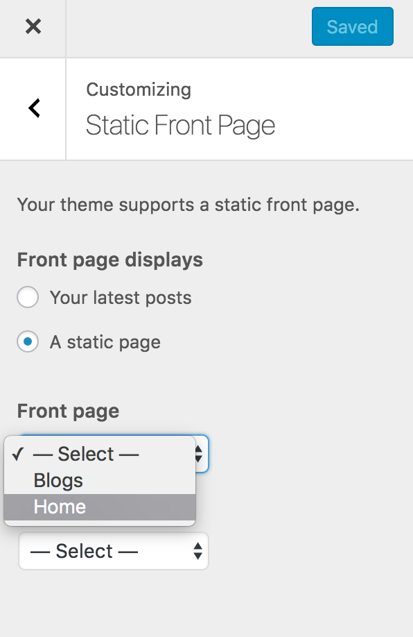
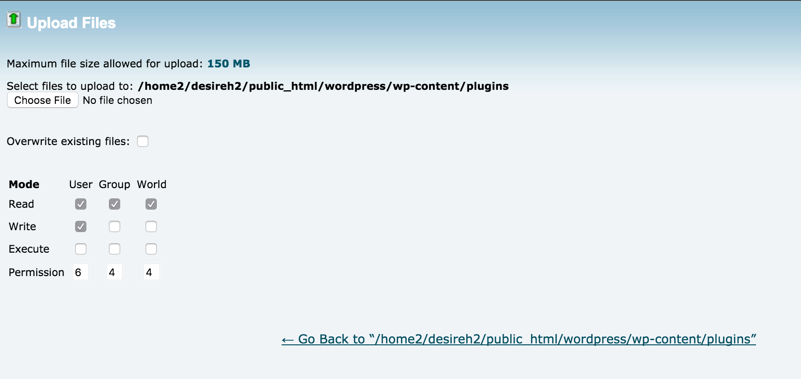
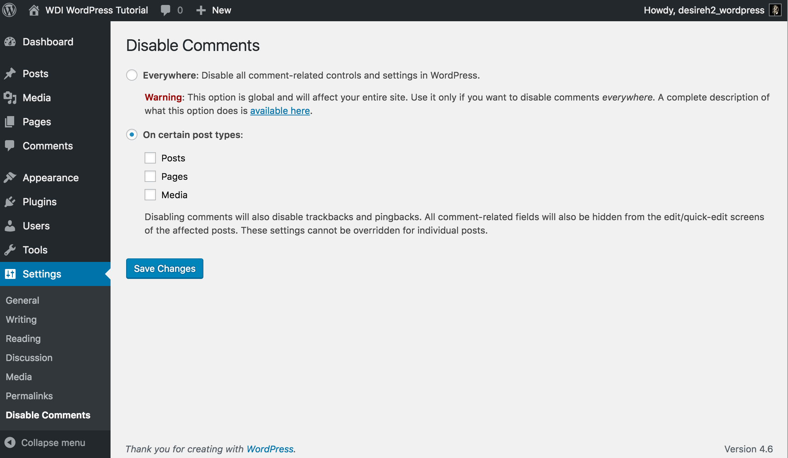

#WordPress Tutorial for WDI

###Link to WordPress website  

###[WordPress Tutorial](http://desireedesario.com/wordpress/)

##What is WordPress?

WordPress is a free and open-source [content management system (CMS)](https://en.wikipedia.org/wiki/Content_management_system) created with PHP and MySQL. Before looking into what WordPress is, it is helpful to understand what a content managing system is. *A CMS is a computer application that helps a group of web content creators with possibly little to no web development experience to create and modify a website using a simple interface to avoid unnecessary struggles with HTML, CSS, or JavaScript for the multiple users.*

WordPress supports the creation and modification of digital content using a simpler interface to abstract away low-level details unless required, usually supporting multiple users working in a collaborative environment. According to Forbes magazine, WordPress is the easiest and most popular blogging system in use on the Web, with over more than 60 million websites.

---

##WordPress.org versus WordPress.com

Wordpress.com is a website where you have to ability to choose a layout, theme, and custom domain (for an extra fee). WordPress.com has limited control as to what you can do with your content whereas Wordpress.org has full controll and its content is customizable.

####WordPress.com

Pros:

- Everything is already laid out for you.
- Themes and layouts are comprehensive.





Cons:

- You must pay for more customizable layouts.
- You Can not Upload Plugins: You are given a comprehensive but still a limited set of features.
- No Ads For Cash: You cannot add advertisements unless you share your ad revenue with WordPress.com
- You Can not Upload Themes: You can only use themes currently available to WordPress.com users. Some of these themes are free and others come with a one time fee. In any case the theme choice is very limited. Secondly, you can not modify those themes. For an additional $30, you can add custom CSS and fonts to your theme but that is it. You cannot modify theme features or theme functionality.
- Account Suspension: If there is profanity on your site, WordPress.com has the ability to suspend your entire website. The website does not need to email or notify the user when they block the site. Visitors of the page can also report a site which can lead to the website being taken down automatically as well.

**CONCLUSION: WordPress.com Not a Development Platform!!!!!**

 WordPress has become a powerful content management system in itself, BUT it is no than more just a blog publishing platform. With WordPress.com, you are only getting a free blog service and not the actual powerful CMS features that are becoming the main reason of WordPress’ popularity. To make it easier for you to understand, let’s suppose that you start with a basic blog and then want to offer online courses, sell digital downloads, or add a forum, or even an online store. It is not possible to do all this on your free WordPress.com blog.

On [WordPress.com](WordPress.com), your content is hosted for you, and unfortunately (or fortunately given your situation) [WordPress.org](WordPress.org) allows you to host your site on your own server.

##Are there dependencies
- PHP
- MySQL or MariaDB

##Similarities/Differences to other types of tech we've studied as WDI

The biggest advantage for using [WordPress.com](WordPress.com) is that non-developers can create web content while not worrying about all the details usually handled by a web developer. However, someone with limited web development skills could also use the resources from [WordPress.org](WordPress.org) to host their own website. [WordPress.com](WordPress.com) hosts the website for you, and you can host a site on your own server with tools from [WordPress.org](WordPress.org).


On [WordPress.com](WordPress.com), each element in the layout can be clicked on and edited via the user interface. The majority of technologies WDI has studied can only be implemented by web developers through [WordPress.org](WordPress.org) with prior knowledge of a using local host server, developing in front end languages, and creating databases through a MySQL server.

---

##Setting up your Wordpress.org site
Requirements:

- Access to your web server (via FTP or shell)
- A text editor
- An FTP Client (like Filezilla or Fetch)
- Your web browser of choice (as well as your domain name of choice)
- Wordpress


###The SetUp


+ Find a webhost like GoDaddy or Bluehost on which to install Wordpress and host our website. For this tutorial, we will be using Bluehost.
+ Download Wordpress 4.6 from Wordpress.org. [Download here](https://wordpress.org/download/)
+ Upload Wordpress to your server using the File Manager in the browser or an FTP client like Filezilla. We will be using the File Manager.
+ Unzip the package in an empty directory and upload everything.
  - With Bluehost, it is necessary to compress files before uploading but other providers may have different requirements.
+ Navigate to the databases on your server, for us -  the terminal in Bluehost, and create a MySQL database:
  - Whether you’re using GoDaddy, BlueHost or another provider, each server has the ability for a “DataBase Manager”, or a place to create large amounts of information in an easy to access manner, such as creating a database for users or repeated content.
	- Type in a database name (of your choice)
	- Type in a database_username (of your choice)
+ Open [wp-admin/install.php](http://desireedesario.com/wordpress/wp-admin/install.php) in your browser. It will take you through the process to set up a wp-config.php file with your database connection details.
	- If for some reason this doesn’t work, don’t worry. It doesn’t work on all web hosts. Open up wp-config-sample.php with a text editor like WordPad or similar and fill in your database connection details.
	- This is where you will enter your database’s name, username, and password. You must connect the database to ‘localhost’.

Example:




- Save the file as wp-config.php and upload it.
- Open [wp-admin/install.php](http://desireedesario.com/wordpress/wp-admin/install.php) in your browser.

(should look like this):



+ Once the configuration file is set up, the installer will set up the tables needed for your blog. If there is an error, double check your wp-config.php file, and try again. If it fails again, please go to the [support forums](https://wordpress.org/support/) with as much data as you can gather.
+ **If you did not enter a password, note the password given to you**. If you did not provide a username, it will be admin.
+ The installer should then send you to the [login page](http://desireedesario.com/wordpress/wp-login.php). Sign in with the username and password you chose during the installation. If a password was generated for you, you can then click on “Profile” to change the password.

##Setting up a Theme

1. On Wordpress.org’s (you’re website) select the ‘customize’ link
2. Select a theme in the side menu
3. You may customize your theme, however it is important to consider that if the Wordpress theme from which you started customizing your website is changed by Wordpress, you may lose your changes. To prevent this, you can create a Child Theme.
	- If you are familiar with CSS, you can also customize your styles in the css folder like you would any other site.



##Setting up a blog with a separate home page that uses a theme

1. Click on the customize feature on the top of your navigation bar. This is the link with the paintbrush icon on the right hand side of the words, “Customization” (Note: this is the same place where we changed our theme, headings, and so forth).
2. Click “Static Front Page” on the home navigation.
	- Under “Front Page Displays” you will use “Static Page”. When you select this choice, WordPress will give you the option of choosing your main home page, which will root the page of your choice to your initial root page.
	 - Note that you will have a dropdown selection for both your homepage and your blog page! Chose each correctly.



##Setting up and installing a plug in

+ You can find multiple plug-ins at: [https://wordpress.org/plugins/](https://wordpress.org/plugins/)
	- For this tutorial we are going to use “Disable Comments” (https://wordpress.org/plugins/disable-comments/installation/), a feature which allows administrators to globally disable comments on their site.
	- Upload the plugin folder to the /wp-content/plugins/ directory



+ Activate the plugin through the 'Plugins' menu in WordPress
+ The plugin settings can be accessed via the 'Settings' menu in the administration area (either your site administration for single-site installs, or your network administration for network installs).



##Setting up and installing a child theme

###How Child Themes Work And Why Use Them

Child themes are separate themes that rely on a parent theme for most of their functionality. If you are using a child theme, WordPress will check your child theme first to see if a specific functionality exists. If it doesn’t, it will use the parent theme. This is great because it allows you to modify only what you need. Child themes should always be used if you plan on modifying even a single style in your theme. There are two very good reasons to use child themes: updates and organization.


1. Create a new directory in ../wp-content/themes/<your directory>
 - You may name this directory anything you wish, but it is recommended that you name it in the following style <parent-theme-name>-child.
2. Create a styles.css & functions.php.
3. Insert the following code into the styles.css
 - The only two items that are essential below are ‘Theme Name’, and ‘Template’.
 - Theme Name indicates your theme name to WordPress.
 - Template points to the parent theme of the child you are creating.
4. Tada!! You can now change to your child theme & reload the page. You should now see all the styles defined by the parent theme with the changes defined in the child theme.


```
/*

Theme Name:   Twenty Fourteen Child
Theme URI:    http://yourwebsite.com/twentyfourteen-child/
Description:  My first child theme, based on Twenty Fourteen
Author:       Daniel Pataki
Author URI:   http://danielpataki.com
Template:     twentyfourteen
Version:      1.0.0
Tags:         black, green, white, light, dark, two-columns, three-columns, left-sidebar, right-sidebar, fixed-layout, responsive-layout, custom-background, custom-header, custom-menu, editor-style, featured-images, flexible-header, full-width-template, microformats, post-formats, rtl-language-support, sticky-post, theme-options, translation-ready, accessibility-ready, responsive-layout, infinite-scroll, post-slider, design, food, journal, magazine, news, photography, portfolio, clean, contemporary, dark, elegant, modern, professional, sophisticated
Text Domain:  twenty-fourteen-child

*/

```

###Cons.. I mean…

##Important Points To Consider

####Databases
Wordpress currently only supports MySQL & MariaDB. There are efforts being made to create support for PostgreSQL, however adding support for another database engine to an existing project requires heavy manipulation of the Wordpress source code.

####Open Source Drawbacks
Source code and plugins create potential security problems. Failure to update plugins are a way for hackers to gain entry into your code.

####Scalability & flexibility
WordPress was intended for use with websites with less content.

####Updates
Closing security holes is made easy updates provided by WordPress. However, updates can break plugins, creating new headaches for a site maintainer. This can leave the site at the mercy of the plugin authors.

####One Size Fits All! Sort of..
Wordpress sites contain lots of generic code that may not be necessary for a specific website. This “bloated code” can slow down your site and affect your user experience.

---

*Resources: [Getting Started With WordPress](https://codex.wordpress.org/Getting_Started_with_WordPress)*
